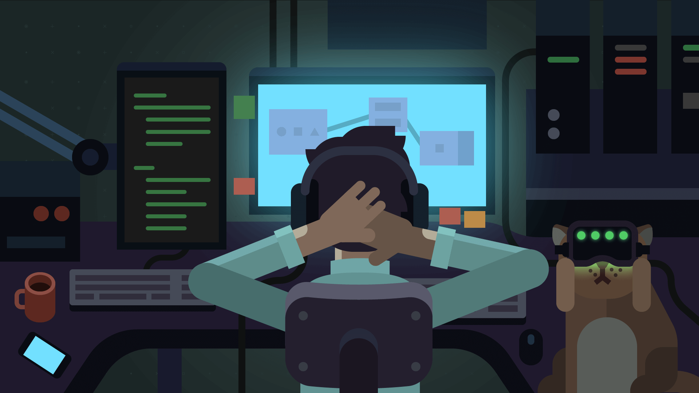

 
<h1 align="left"> Hi, developer! 👋 </h1>

 I'm Enzo Athayde, but you can call me Enzo. Actually i study programming in a private university, with focus in performance. 

 

 <code> main technologies 👨‍💻 </code>  

 

